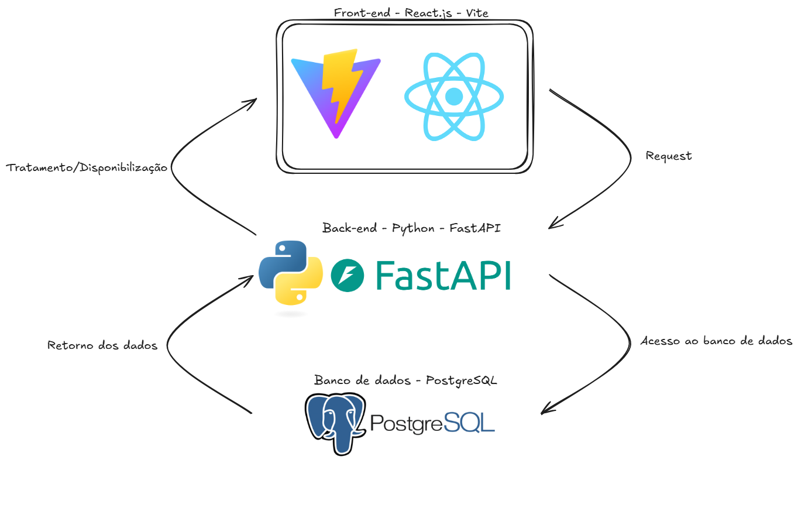

# Arquitetura do Sistema
## Introdução
Para a organização e desenvolvimento desta aplicação, foi adotada a arquitetura MVC (Model-View-Controller), um padrão amplamente utilizado em sistemas web por promover a separação de responsabilidades, facilitando a manutenção, escalabilidade e testes da aplicação.

Na arquitetura MVC, a aplicação é dividida em três camadas principais:

- Model (Modelo): Responsável pela estruturação e manipulação dos dados da aplicação, incluindo as regras de negócio e a comunicação com o banco de dados.

- View (Visão): Responsável pela apresentação das informações ao usuário. Em aplicações web modernas, pode incluir templates HTML, respostas JSON ou qualquer outro formato de saída.

- Controller (Controlador): Atua como intermediário entre o Model e a View, recebendo as requisições dos usuários, processando as regras de negócio e definindo qual resposta será retornada.

Neste projeto, utilizaremos o framework FastAPI, que, embora não imponha diretamente uma estrutura MVC, permite sua implementação de maneira organizada e eficiente graças à sua arquitetura flexível e suporte nativo a rotas, dependências e validação de dados. A aplicação será estruturada de modo a manter a separação clara entre as camadas:

- Os Models serão implementados utilizando Pydantic para validação e definição de schemas, e bibliotecas de ORM para interação com banco de dados, como o SQLModel ou SQLAlchemy.

- As Views corresponderão às respostas HTTP enviadas pela API, podendo ser JSON ou outro formato compatível.

- Os Controllers serão implementados como rotas (endpoints) definidas nas operações da FastAPI, responsáveis por receber as requisições, invocar os serviços e retornar as respostas apropriadas.

Essa abordagem possibilita que o projeto seja modular, de fácil manutenção e alinhado às boas práticas de desenvolvimento de APIs modernas em Python.

## Arquitetura da Aplicação

A aplicação será construída seguindo uma arquitetura baseada em **camadas independentes**, separando claramente as responsabilidades entre a interface do usuário, a lógica de negócio e o armazenamento de dados. Essa estrutura facilita a manutenção, o desenvolvimento paralelo e a escalabilidade do sistema.

- **Front-end:** Desenvolvido com **React JS** e **Vite**, responsável pela interface gráfica e pela interação com o usuário. O front-end consumirá as APIs disponibilizadas pelo back-end via requisições HTTP, exibindo os dados de forma dinâmica e responsiva no navegador.

- **Back-end:** Implementado em **Python** utilizando o framework **FastAPI**, será responsável por processar as regras de negócio, validar os dados, controlar o fluxo da aplicação e expor as APIs RESTful para consumo do front-end. O FastAPI oferece alta performance, suporte a tipagem estática e integração eficiente com ferramentas modernas.

- **Banco de Dados:** Utilizaremos o **PostgreSQL** para armazenamento estruturado das informações. O back-end se conectará ao banco de dados para realizar operações de leitura, escrita e atualização de dados de forma segura e otimizada.

## Referências

[1] FASTAPI. **FastAPI Documentation**. Disponível em: [https://fastapi.tiangolo.com/](https://fastapi.tiangolo.com/). Acesso em: 7 maio 2025.

[2] REACT. **React Documentation**. Disponível em: [https://react.dev/](https://react.dev/). Acesso em: 7 maio 2025.

[3] VITE. **Vite Documentation**. Disponível em: [https://vitejs.dev/](https://vitejs.dev/). Acesso em: 7 maio 2025.

[4] THE POSTGRESQL GLOBAL DEVELOPMENT GROUP. **PostgreSQL Documentation**. Disponível em: [https://www.postgresql.org/docs/](https://www.postgresql.org/docs/). Acesso em: 7 maio 2025.

[5] Pydantic. **Pydantic Documentation**. Disponível em: [https://docs.pydantic.dev/](https://docs.pydantic.dev/). Acesso em: 7 maio 2025.

[6] SQLModel. **SQLModel Documentation**. Disponível em: [https://sqlmodel.tiangolo.com/](https://sqlmodel.tiangolo.com/). Acesso em: 7 maio 2025.

[7] SQLAlchemy. **SQLAlchemy Documentation**. Disponível em: [https://docs.sqlalchemy.org/](https://docs.sqlalchemy.org/). Acesso em: 7 maio 2025.

> Acesso em 7 de Maio de 2025

