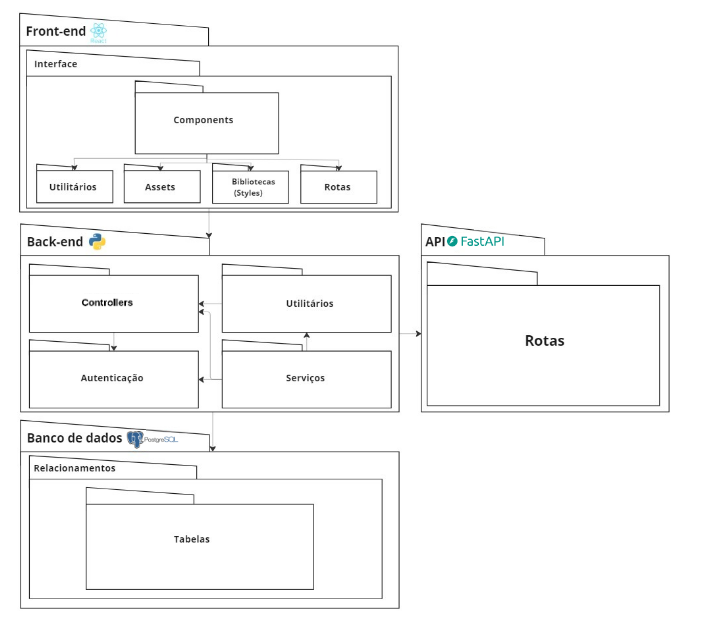

# Diagrama de Pacotes

## 1. Introdução

O diagrama de pacotes é uma técnina de modelagem utilizada, principalemten, para visualizar e organizar a estrutura de pacotes e subpacotes em um sistema, seja ele complexo ou não, de forma que toda sua estrutura e seus componentes sejam de fácil compreensão. Alem disso, o diagrama de pacotes é um diagrama de estrutura UML que mostra a estrutura do sistema projetado no nível de pacotes, onde os elementos são tipicamente desenhados em um diagrama, contendo: pacote, elemento empacotável, dependência, importação de elemento, importação de pacote, fusão de pacote.

Em um diagrama de pacotes, os pacotes são representados em retângulos, com a identificação daquele pacote disponibilizada dentro dos retângulos. Os subpacotes são mostrados como retângulos menores dentro do pacote principal. As dependências entre os pacotes são representadas por linhas que conectam esses retângulos, indicando como os pacotes estão relacionados.

## 2. metodologia
Para relizar a criação deste artefato, foi feita a análise do escopo do projeto, levando em consideração, de forma téorica, os seguintes items:

- Back-end: Serviços, utilitários, autenticação.
- Front-end: Componentes, bibliotecas de estilização.
- Banco de dados: relacionamentos, tabelas.
- Serviços: API.

## 3. Resultados

## 5. Referências

Documentação UML Package Diagrams Overview https://www.uml-diagrams.org/package-diagrams-overview.html. Acesso em 2 de Maio de 2025